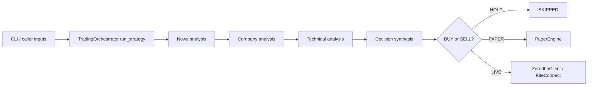

# Codebase notes: Jules / Shargent

This repository has two independent applications:

* `shargent/` is a Python proof-of-concept for an agentic Indian-equities trader using Zerodha Kite.
* `app/` is an unrelated Android/Kotlin Meta Game sample (a dashboard and Tic-Tac-Toe); it does not interact with Shargent.

The trading system was added in commit `52b038b` by `google-labs-jules[bot]`. The configured origin is `git@github.com:sbspub/jules.git`. There is no Python dependency manifest, README, packaging configuration, or automated market-data ingestion in the repository.

## Shargent execution path

`python -m shargent.main --symbol RELIANCE --strategy AUTO_DAY_TRADE --mode PAPER --qty 10`

`shargent/main.py` parses those CLI arguments, constructs `TradingOrchestrator`, calls `run_strategy`, then prints the three analyses, decision, execution result, and in-memory paper portfolio summary.

The LangGraph pipeline is strictly sequential; it does not run the analyses concurrently. `AgentState` in `shargent/orchestrator/graph.py` defines its inputs and outputs.

## Inputs and default behavior

`TradingOrchestrator.run_strategy()` accepts `news_items`, `financials`, and `price_history`, but the CLI supplies none. The method therefore creates deterministic sample data: one positive earnings headline, fixed financial ratios, and 30 upward-trending OHLCV bars. This can produce a paper trade without any live market/news/fundamental feed.

The orchestrator and paper engine are recreated on every CLI run. Positions, cash, trades, and learning statistics exist only for that process and are not persisted.

## Analysis modules

| Module | Inputs | Behavior | Output used for trading |
|---|---|---|---|
| `news_analyser/analyser.py` | headlines/articles | Calls an OpenAI structured-output model only with a non-placeholder key; otherwise keyword scoring | `overall_sentiment` (`BULLISH`, `BEARISH`, `NEUTRAL`) |
| `company_analyser/analyser.py` | P/E, P/B, debt/equity, ROE, revenue growth, margin | Deterministic 0–100 score. Only ROE, debt/equity, growth, and P/E affect the score; P/B and margin are reported but unused. | health and `fundamental_score` |
| `technical_analyser/analyser.py` | OHLCV bars | RSI(14), MACD(12/26/9), VWAP, rolling 50/200 averages, support/resistance | short and long-term signals |

Technical details that affect future changes:

* The 50/200 averages use the data available (`min(window, len(data))`), so fewer than 200 bars still yield an apparent `sma_200`.
* Support and resistance are simply the full input low/high, with no rolling window.
* `confidence_score` is calculated but does not influence the final decision.
* An empty price history returns fixed neutral placeholder values.

## Decision rules

The decision logic is entirely in `_synthesize_decision_node`:

* `AUTO_DAY_TRADE` and `SHORT_TERM_TRADE`: buy when the short-term technical signal is `BUY` and news is bullish or neutral. Sell when technical is `SELL` **or** news is bearish. Otherwise hold.
* `LONG_TERM_INVESTMENT`: buy when score is at least 65, health is `STRONG`, and long-term technical is `BUY` or `HOLD`. Sell on a score below 40 or weak health. Otherwise hold.
* Orders are `MARKET`; product is `MIS` for short/day strategies and `CNC` for long-term investments.

Neither the `Settings` risk values (maximum capital, stop loss, target profit) nor analysis confidence are enforced anywhere. Quantity is not validated for positivity before a live order is attempted.

## Execution modes and safety boundary

`PAPER` (the CLI default) calls `PaperEngine.execute_paper_trade`. It tracks cash, average cost, positions, realized P&L, and trade history in memory. It permits sells only against an existing paper position; short selling is unsupported. Prices are the technical analyser's last input close.

`LIVE` calls `ZerodhaClient.place_order`. The client uses KiteConnect only when both `ZERODHA_API_KEY` and `ZERODHA_ACCESS_TOKEN` exist and the API key does not begin with `mock`. In that state, a BUY or SELL decision submits a real regular NSE order. On missing credentials or Kite initialization failure, the client silently uses its mock implementation instead. The API secret is configured but unused.

The client also exposes profile, margins, quote, orders, positions, holdings, and cancellation methods. Its fallback values are fabricated examples and must not be treated as account or market data.

## Configuration

`shargent/config.py` creates a module-level `settings` object from environment variables:

* `OPENAI_API_KEY`, optional; placeholder default `mock_key`
* `OPENAI_MODEL`, default `gpt-4o-mini`
* `ZERODHA_API_KEY`, `ZERODHA_API_SECRET`, `ZERODHA_ACCESS_TOKEN`, optional

It calls `load_dotenv("~/.env")`. With python-dotenv this literal path may not expand `~`; environment variables are therefore the reliable current configuration mechanism unless this is changed.

## Tests and current coverage

The six pytest files cover the basic happy paths for each analyser, mock Zerodha calls, paper buy/sell P&L, and end-to-end PAPER orchestration. They do not cover live Kite submission, failed API calls, validation, risk controls, persistence, genuine market-data ingestion, or end-to-end CLI operation.

## Change map

| If changing… | Start with… | Also examine… |
|---|---|---|
| signal formulas | `technical_analyser/analyser.py` | decision rules and `tests/test_technical_analyser.py` |
| news or LLM behavior | `news_analyser/analyser.py` | config and `tests/test_news_analyser.py` |
| fundamental scoring | `company_analyser/analyser.py` | long-term decision thresholds and its tests |
| strategy selection | `orchestrator/graph.py` | CLI choices in `main.py` and orchestrator tests |
| paper portfolios | `paper_trading/paper_engine.py` | learning metrics and paper-trading tests |
| real Zerodha behavior | `zerodha_trading/zerodha_client.py` | `LIVE` branch in `graph.py`; test against Kite only with deliberate operational controls |

## Known limitations to retain in mind

This is a scaffold, rather than a production trading system: data is caller-provided or synthetic, safeguards are declarative only, paper state is transient, execution outcomes are not reconciled, and a configured `LIVE` run can place a real market order. Future changes should make execution, data freshness, risk validation, and persistence explicit before relying on it operationally.
